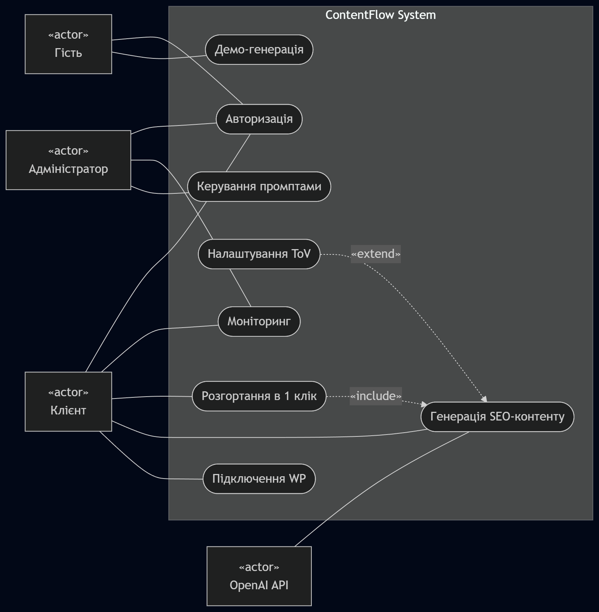
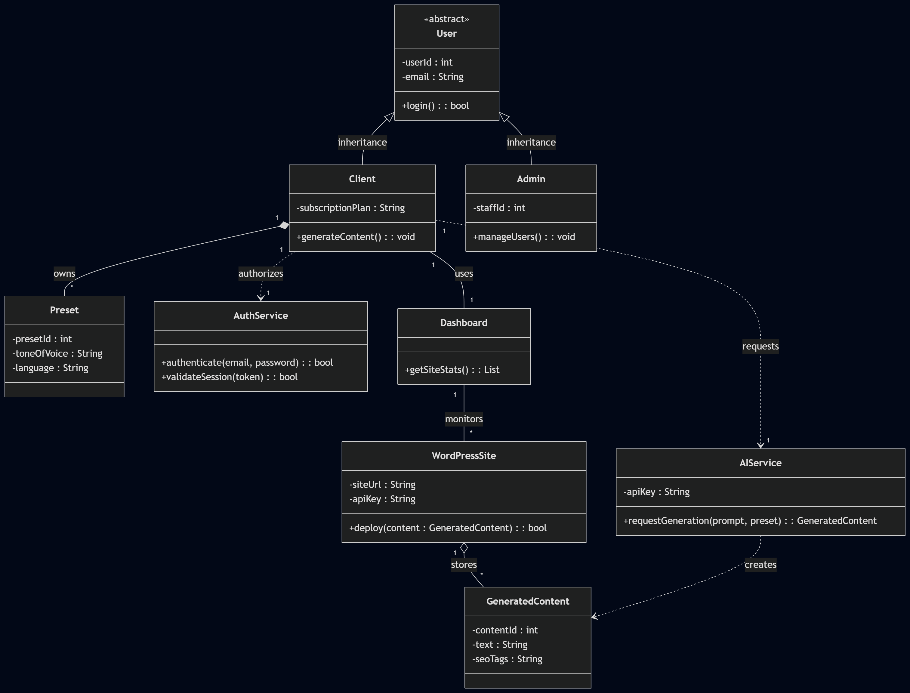
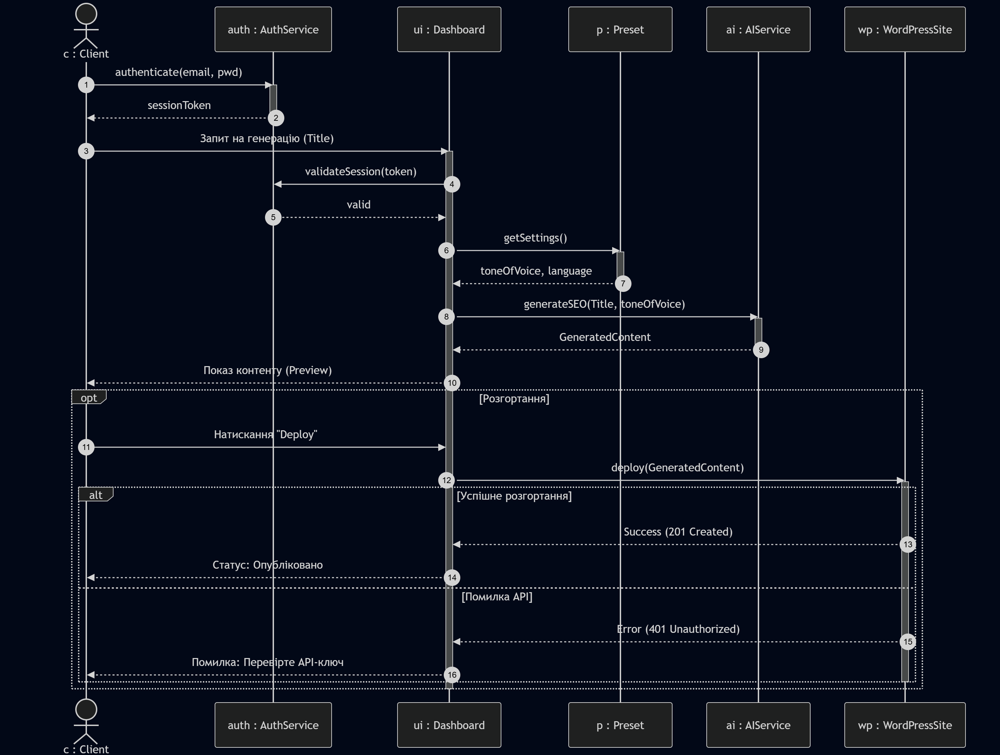

# Лабораторна робота №2

## 1. Функціональні вимоги
* **FR-01:** Авторизація через email або Google OAuth.
* **FR-02:** Підключення WordPress-сайтів через API.
* **FR-03:** Керування шаблонами налаштувань (пресетами).
* **FR-04:** Розгортання контенту на сайт в 1 клік.
* **FR-05:** ШІ-генерація SEO-описів на основі назви товару.
* **FR-06:** Дашборд для моніторингу підключених ресурсів.
* **FR-07:** Вибір мови та тональності контенту.

## 2. UML Моделі

### Діаграма прецедентів

### Діаграма класів

### Діаграма послідовності

## 3. Матриця трасовності

| Вимога | Use Case | Класи | Sequence |
| :--- | :--- | :--- | :--- |
| FR-01 | UC_Auth | User, Client, Admin, AuthService | SD-01 (фрагмент) |
| FR-02 | UC_Connect | Client, WordPressSite | — |
| FR-03 | UC_ToV | Client, Preset | — |
| FR-04 | UC_Deploy | Client, Dashboard, WordPressSite, GeneratedContent | SD-01 (фрагмент) |
| FR-05 | UC_Generate | Client, Dashboard, Preset, AIService, GeneratedContent | SD-01 (Генерація SEO) |
| FR-06 | UC_Dashboard | Client, Admin, Dashboard, WordPressSite | — |
| FR-07 | UC_ToV | Preset | SD-01 (фрагмент) |

Усі діаграми та матриця трасовності в межах цієї лабораторної роботи були розроблені студентом Старченко Олександр
